# Token Optimizer

**Your config stack silently eats 16% of every context window.** This finds the waste and fixes it.



## Install

```bash
curl -fsSL https://raw.githubusercontent.com/alexgreensh/token-optimizer/main/install.sh | bash
```

Then start Claude Code and run:

```
/token-optimizer
```

Or manually:

```bash
git clone https://github.com/alexgreensh/token-optimizer.git ~/.claude/token-optimizer
ln -s ~/.claude/token-optimizer/skills/token-optimizer ~/.claude/skills/token-optimizer
```

Updates are instant: `cd ~/.claude/token-optimizer && git pull`. The installer uses a symlink, so the skill always loads from the repo directory.

## The Problem

Every message to Claude Code re-sends your entire config stack. The API is stateless: system prompt, tool definitions, skills, commands, CLAUDE.md, MEMORY.md, system reminders. All of it, every time.

Prompt caching cuts the **cost** of this by 90% (96-97% cache hit rate per Anthropic internal data). But caching doesn't shrink the **size**. Those tokens still occupy your context window, still count toward rate limit quotas, and still degrade output quality past 50-70% fill.

A typical power user who has never audited their config: **~33,000 tokens per message (16% of 200K context)**. That's before you type a word.

| What's eating your context | Typical | Source |
|---------------------------|---------|--------|
| Core system + tools | 15,000 | Fixed. You can't change this. |
| Skills (50 accumulated) | 5,000 | ~100 tokens per skill frontmatter |
| CLAUDE.md (grown organically) | 3,500 | [Leo Wong](https://youtu.be/jWl5O8K2fPk): 700-line CLAUDE.md = 12K tokens |
| System reminders (no .claudeignore) | 3,000 | Auto-injected on file edits, budget warnings |
| MEMORY.md (duplicates CLAUDE.md) | 2,500 | Grows without auditing |
| MCP deferred tools (~130 tools) | 2,500 | ~15 tokens per deferred tool name |
| Commands (25 accumulated) | 1,250 | ~50 tokens per command |

### Historical context

In 2025, MCP tool definitions were the worst offender. 50 tools meant 25K+ tokens gone before you typed:

| Setup | Measured Overhead | Source |
|-------|------------------|--------|
| Zero MCP, fresh install | ~11,600 tokens | [GitHub #3406](https://github.com/anthropics/claude-code/issues/3406) |
| 7 MCP servers | 67,300 tokens (34%) | [GitHub #11364](https://github.com/anthropics/claude-code/issues/11364) |
| Heavy MCP setup | ~82,000 tokens (41%) | [Scott Spence](https://scottspence.com/posts/optimising-mcp-server-context-usage-in-claude-code) |

[Tool Search](https://www.anthropic.com/engineering/advanced-tool-use) (default since Jan 2026) fixed the biggest offender: 85% reduction on MCP overhead. But the rest of the config stack still adds up, and most users never audit it.

## What It Finds


One command. Six parallel agents audit your setup. You get a prioritized fix list with exact token savings.

| Area | What It Catches |
|------|----------------|
| **CLAUDE.md** | Content that should be skills or reference files, duplication with MEMORY.md, poor cache structure |
| **MEMORY.md** | Overlap with CLAUDE.md, verbose history that should be condensed |
| **Skills & Plugins** | Plugin-bundled skills you never use, semantic duplicates, archived skills still loading |
| **MCP Servers** | Unused servers, duplicate tools across servers and plugins, missing Tool Search |
| **Commands** | Rarely-used commands, merge candidates |
| **Advanced** | Missing .claudeignore, no hooks, poor cache structure, no monitoring |

### The Fix: Progressive Disclosure

Not everything belongs in CLAUDE.md. The optimizer applies a three-tier architecture:

| Tier | Where | Cost | What Goes Here |
|------|-------|------|----------------|
| **Always loaded** | CLAUDE.md | Every message (~800 tokens target) | Identity, critical rules, key paths |
| **On demand** | Skills, reference files | ~100 tokens in menu. Full content only when invoked. | Workflows, tool configs, detailed standards |
| **Explicit** | Project files | Zero until read | Full guides, templates, documentation |

A bloated CLAUDE.md doesn't need deleting. Coding standards move to a reference file. A deployment workflow becomes a skill. Personality spec condenses to one line with the full version in MEMORY.md. Same functionality, fraction of the per-message cost.

## Why It Matters (Even With Prompt Caching)

Prompt caching is real. It cuts cost by 90% on cached prefixes. But here's what caching does NOT fix:

**Context window size.** 33,000 tokens of overhead means 33,000 fewer tokens for your actual work. You hit compaction sooner, and compaction is lossy.

**Rate limits.** Cache reads still count toward subscription usage quotas. Smaller overhead = slower quota burn = longer before you hit rate limits.

**Quality degradation.** Claude's performance degrades as context fills. Matt Pocock: "Models tend to perform worse the more things you add to their context." The "lost in the middle" effect means information between the start and end of context gets ignored.

**Multi-agent amplification.** Each subagent inherits your full config overhead. Official docs: "Agent teams use approximately 7x more tokens than standard sessions." 11,550 tokens saved per message x N agents per task.

**Compounding.** 11,550 tokens/msg x 100 messages/day = 1.15M tokens of overhead saved daily. That's context space you get back for actual work.

## How It Works


| Phase | What Happens |
|-------|-------------|
| **Initialize** | Backs up config, creates coordination folder, takes a "before" snapshot |
| **Audit** | 6 parallel agents (4 sonnet + 2 haiku) scan config, skills, MCP, and more |
| **Analyze** | Synthesis agent (opus) prioritizes into Quick Wins / Medium / Deep tiers |
| **Implement** | You choose what to fix. Backups, diffs, approval before any change |
| **Verify** | Re-measures everything, shows before/after with exact savings |

Right model for each job. Sonnet for judgment calls, haiku for data gathering, opus for cross-cutting synthesis. Session folder pattern prevents agent output from flooding your context.

## Sourced Numbers

All referenced stats from [Anthropic docs](https://code.claude.com/docs/en/costs), [Piebald-AI system prompt tracking](https://github.com/Piebald-AI/claude-code-system-prompts) (v2.1.59), and community measurements linked above.

| What | Number | Source |
|------|--------|--------|
| Core system prompt | ~3K tokens (fixed) | Piebald-AI |
| Built-in tool definitions | 12-17K tokens (fixed) | Piebald-AI |
| Each MCP tool (pre-Tool Search) | 300-850 tokens | Community measurement |
| Each MCP tool (with Tool Search) | ~15 tokens (name only) | Anthropic |
| Each skill | ~100 tokens (frontmatter) | Piebald-AI |
| Each command | ~50 tokens | Piebald-AI |
| [Tool Search](https://www.anthropic.com/engineering/advanced-tool-use) MCP reduction | **85%** (Anthropic: 134K to ~8.7K) | [Anthropic Engineering](https://www.anthropic.com/engineering/advanced-tool-use) |
| Prompt caching on stable prefixes | **90% cost reduction** | [Anthropic Docs](https://platform.claude.com/docs/en/build-with-claude/prompt-caching) |
| Cache hit rate in active sessions | **96-97%** | Anthropic engineer Taric ([Abhishek Ray](https://youtu.be/8J5LRHJ5mDk)) |
| /compact: conversation history | **77K to 4K tokens** (18x reduction) | [Matt Pocock](https://youtu.be/KNz6hJFLO0k) |
| Auto-compact default threshold | **95%** (too late, set to 50-70%) | [Official docs](https://code.claude.com/docs/en/settings) |
| Agent teams token multiplier | **~7x** standard sessions | [Official docs](https://code.claude.com/docs/en/costs) |

## Measurement Tool

Standalone Python script for measuring token overhead:

```bash
python3 ~/.claude/token-optimizer/scripts/measure.py report

# Save snapshots for comparison
python3 ~/.claude/token-optimizer/scripts/measure.py snapshot before
# ... make changes ...
python3 ~/.claude/token-optimizer/scripts/measure.py snapshot after
python3 ~/.claude/token-optimizer/scripts/measure.py compare
```

No dependencies. Python 3.8+.

## vs Alternatives

| Tool | What It Does | Limitation |
|------|-------------|------------|
| **Manual audit** | Flexible | Takes hours. No measurement. Easy to miss things |
| **ccusage** | Monitors spending | Shows what you spent, not why or how to fix it |
| **token-optimizer-mcp** | Caches MCP calls | One dimension only |
| **This** | Audits, diagnoses, fixes, measures | Requires Claude Code |

## What's Inside

```
skills/token-optimizer/
  SKILL.md                             Orchestrator
  references/
    agent-prompts.md                   8 agent prompt templates
    implementation-playbook.md         Fix implementation details
    optimization-checklist.md          22 optimization techniques
    token-flow-architecture.md         How Claude Code loads tokens
  examples/
    claude-md-optimized.md             Optimized CLAUDE.md template
    claudeignore-template              .claudeignore starter
    hooks-starter.json                 Hook configuration example
scripts/measure.py                     Before/after measurement tool
install.sh                             One-command installer
```

## License

AGPL-3.0. See [LICENSE](LICENSE).

Created by [Alex Greenshpun](https://linkedin.com/in/alexgreensh).
